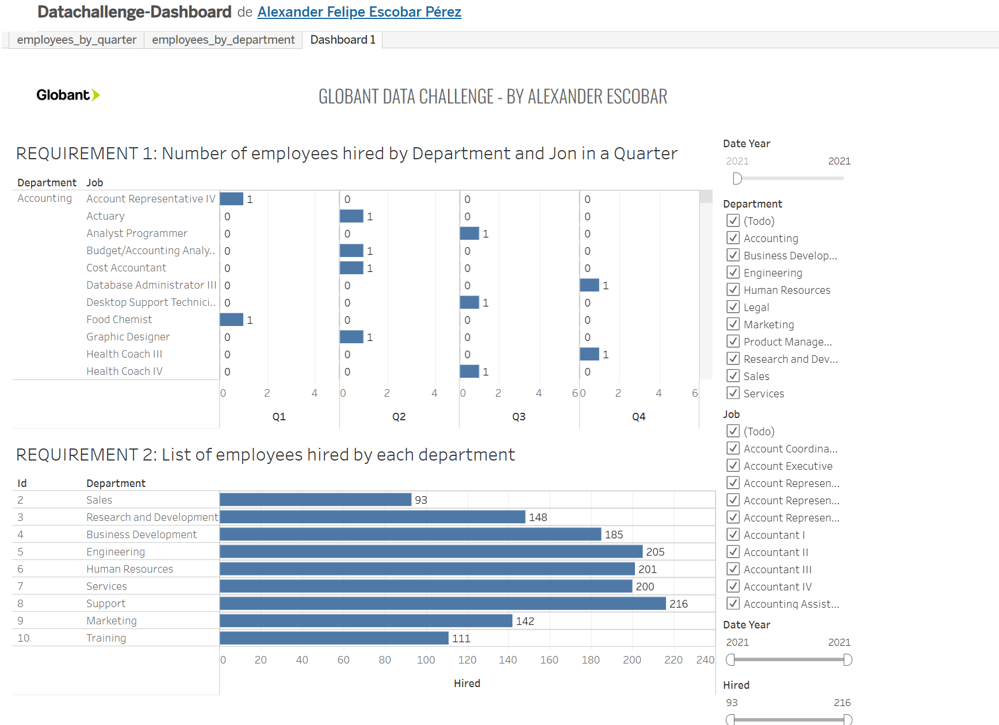

# Data Challenge

Data challenge proposed by Globant on the interview process

## Project Description

This project is a technical test for a job interview. The objective is to analyze and visualize data using Python, a PostgreSQL database, and AWS services. The aim is to demonstrate skills in data manipulation, analysis, and cloud deployment.

## Contents

- [Used technologies](#used-technologies)
- [Installation](#installation)
- [Usage](#usage)
- [ETL initial load](#etl-initial-load)
- [API](#api)
- [Security with jwt](#security-with-jwt)
- [Backup and restore data](#backup-and-restore-data)
- [Report endpoints](#report-endpoints)
- [Github Deploy](#github-deploy)
- [Unit test](#unit-test)
- [Visual report](#visual-report)

## Used Technologies


- **Python**: Main Lenguage used.
- **AWS S3**: Storage for initial files.
- **AWS PostgreSQL**: The relational database configured on AWS Cloud.
- **FLASK**: To create the API
- **JWT**: To add security using a token
- **SWAGGER**: To create the specification of the API
- **DOCKER**: To create a container to deploy de app
- **PYTEST**: To create unit test
- **TABLEAU**: To create a Dashboard

## Installation

To configure the development environment, follow these steps:

1. Clone repository:
   ```bash
   git clone https://github.com/tu_usuario/data-challenge.git
   cd data-challenge
   ```
2. The first step is always to make sure you have the virtual environment to download dependencies
   If you don't, please follow these commands to set it up.

   > python3 -m venv myenv
   > source myenv/bin/activate
   > After this, let's install the requirements:
   > pip install -r requirements.txt

3. After checking the availability of the database (start up), configure the data connection string
   in the file config.ini setting the proper values on variables in the [database] segment.

# Usage

There are two elements in the repository:

1. ETL to load the initial data
2. API with functionalities required
   2.1 2.4 Add data to tables 3. Backup the tables in AVRO format 4. Restore the backup 5. End ponts from challenge #2

## ETL initial load

The first step is running the ETL to load the file data.
This is necessary to set the data from the S3 bucket into the database.

The original files are stored in a S3 bucket

_Description: Displaying the main bucket, inside each folder is placed the file according to the name._

To run this process use this command:

```bash
> python src/main_etl_process.py
```

The process will load the three elements (jobs, departments and hired_employees) data with a brief summary reporting the number of total, valid and invalid records.

### Tables in database

After running the ETL, you can use your predilected IDE to review the creation of the tables, I use pgAdmin4 to check the data.


_Description: Displaying Tables and records from employees._

### ETL Logs


_Description: Displaying logs generated during the ETL process._

### ETL file records with errors


_Description: Displaying CSV file stored only with the records with problems to enable a quick review._

## API

To run the API locally you use this command:

```bash
> python src/app.py
```

### API Specification

I used swagger to make it easy to understand the endpoints you can find in this service.
To access locally, please use this URL: http://127.0.0.1:5000/swagger/#/

You should be able to see a page like this:


_Description: Displaying swagger document._

### Security with JWT

To enable to use the endpoints, you need first to create a token, I used postman to create the request but you can use your favorite tool.

You need to use the GET /login endpoint, go to the Authorization tab, select the "Basic Auth" option and add the user and password as shown:


_Description: Displaying the way to use the login endpoint to generate a token._

Note:

- Please copy the token for further use.
- The token has 30 minutes lifetime

### Accessing endpoints

This is a standard process, but I added a brief explanation for the POST /upload endpoint as a reference.

First, you need to set the token, go to the Authorization tab, select the "Bearer token" option and, add the token received from the /login end point in the previous section as shown:


_Description: Displaying the way to use the set token for any endpoint._

After setting the toke, you can configure the specific parameters or elements required for the endpoint (as you can validate in the swagger document), for the POST /upload end point you need to add a file and a type of file in the Body tab using the "form-data" option:


_Description: Displaying the way to add the file and the tipe to load new data in the database._

You click the "send" button, and should get a confirmation message like this:


_Description: Displaying the correct message when data is inserted in the database._

The data from the file must be in the database:


_Description: Displaying the data inserted in the database._

### Data validation

It's quite possible the file used to load the data has some errors, the API as the ETL performs a validation process before loading the records to the database,and the elements with errors will be stored in the s3 bucket using the file name and the date and time of loading to check the issues.


_Description: Displaying one of the possible messages when the validation process rejects rows._

You also may want to go to the bucket to check the error file.


_Description: Displaying the file with the records rejected by the data validation._

### Backup and restore data

- There are two endpoints for this specific requirement the first one creates the backup GET /backup will create the files in AVRO format in the S3 bucket


_Description: Displaying the files in AVRO format created by running the endpoint._

- The other one is GET /restore, which uses the files previously created to restore the tables.

### (CHALLENGE #2)

### Report endpoints

For the report, we have two endpoints to get the data from the database, they are paginated.

#### Data by Quarter


_Description: Displaying the data returned by the endpoint._

#### Hired above mean


_Description: Displaying the data returned by the endpoint._

# Github Deploy

I configured the GitHub workflow to deploy the API using an EC2 machine
NOTE: The machine used is in a free tier, the ip will change


_Description: Displaying the pipeline execution successfully ended._

## Deploy with Docker

Creating a docker image, I configured a workflow for the main branch to deploy de app using a container.

This is the image in Dockerhub:


_Description: Displaying the image created in the <flask-api> repository._

New workflow using docker:

_Description: Displaying the pipeline using docker execution successfully ended._

NOTE: Using docker the port configured is 8080.

# Unit test

Using Pytest, I added some unit test to make easy future changes.

I created the coverage report:


_Description: Displaying the coverage for each file with unit tests._

# Visual Report

Using the BI tool Tableau (I'm not an expert in Tableu, but I got the concepts from analytics perspective), I created this report to play with the data from the specific requirements.

https://public.tableau.com/views/Datachallenge-Dashboard/Dashboard1?:language=es-ES&:sid=&:redirect=auth&:display_count=n&:origin=viz_share_link


_Description: Displaying the dashbboard._
